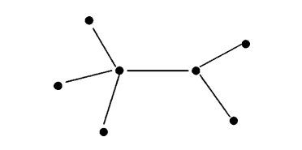
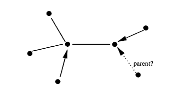
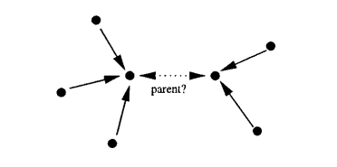
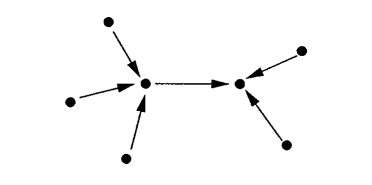

.. include:: substitutions.rst

|IEEElection|
=========================================

Background and Related Work
~~~~~~~~~~~~~~~~~~~~~~~~~~~~~~
The [IEEE]_ standard mentions about the problem under the concept of isochronous resource manager (IRM) selection.
It also provides examples of processes for selecting the IRM within a backplane environment.
However, it doesn't go into the algorithmic details of how the selection process should be implemented.

Additionally, [Devillers]_ formalizes a simple algorithm for this IEEE standard protocol.
This paper addresses ambiguities and challenges encountered during the process.
The authors of the paperesspecially focuses on the tree identify phase.
This paper serves as formal verification of this distributed algorithm. We will also use their method in our implementation.

.. [IEEE] IEEE Standard for a High Performance Serial Bus," in IEEE Std 1394-1995 , vol., no., pp.326-327, 30 Aug. 1996, doi: 10.1109/IEEESTD.1996.81049.
.. [Devillers] Devillers, M., Griffioen, D., Romijn, J. et al. Verification of a Leader Election Protocol: Formal Methods Applied to IEEE 1394. Formal Methods in System Design 16, 307–320 (2000).

Distributed Algorithm: |IEEElection| 
~~~~~~~~~~~~~~~~~~~~~~~~~~~~~~~~~~~~~~~~~~~~~~~~~~~~~~~~~~~~~~~~~~~~~~~~~~~~~~~~~~~~~~~~~~~~~~~~~~~~~~~

An example distributed algorithm for finding a leader/isochronous resource manager(IRM) on an undirected graph is presented in  :ref:`Algorithm <IEEEalgorithmLabel>`.

.. _IEEEalgorithmLabel:

.. code-block:: RST
    :linenos:
    :caption: Leader Election algorithm in IEEE 1394.
    

    Implements: 
    Uses: 
        send_message,  # sends message to given neighboor for asking parentage
        send_ack_message,  # sends message to given neighboor for accepting parentage
        set_timer,  # set timer after the timer ends that uses the given function with given arguments.
        remove_timer,  # remove timer for that neighboor
    Events:
        Init,
        MessageNeighboor,
        OnMessageFromNeighboor,
        OnReceivingAcknowledgementMessageFromNeighboor,
        OnReceivingParentageRequstFromNeighboor,
    Needs: 
        adjacent_nodes_set: ans,
        my_node_id: my_node_id

    OnInit: () do
        parent = None
        message_queue_set = set()
        remaining_ans = ans.deep_copy()
        remaining_neighboor_count = remaining_ans.length()
        If remaining_neighboor_count == 1:  # becomes a leaf
            last_neighboor = remaining_ans.first()
            MessageNeighboor(last_neighboor)
    
    MessageNeighboor: ( x ) do
        If my_node_id < x:
            parent = x
        send_message(x)  # will u be my father
        set_timer(x, MessageNeighboor, x)
        message_queue_set.add(x)

    OnMessageFromNeighboor: ( message, x ) do
        If message is 'acknowledgement':
            OnReceivingAcknowledgementMessageFromNeighboor(x)
        Else If message is 'parentage request':
            OnReceivingParentageRequstFromNeighboor(x)
    
    OnReceivingAcknowledgementMessageFromNeighboor: (x) do
        remove_timer(x)
        message_queue_set.remove(x)
        parent = x # lifecycle of this node ends

    OnReceivingParentageRequstFromNeighboor: (x) do
        neighboor_is_the_father = False
        If parent == x:  # parent chosen as x before thus contention
            neighboor_is_the_father = True
            send_message(x)
        Elif x in message_queue_set:  # other party whose id is lower chosen me as parent thus contention
            remove_timer(x)
            message_queue_set.remove(x)
            root = my_node_id  # root is chosen  if it is needed for everyone to know broadcase message can be added
        
        If not neighboor_is_the_father:
            remaining_ans.remove(x)
            remaining_neighboor_count -= 1
            send_ack_message(x)
            If remaining_neighboor_count == 1:  # becomes a leaf
                last_neighboor = remaining_ans.first()
                MessageNeighboor(last_neighboor)

Informally, the basic idea of the protocol is as follows: leaf nodes send a “parent request”
message to their neighbor. When a node has received a parent request from all but one of
its neighbors it sends a parent request to its remaining neighbor. In this way the tree grows
from the leafs to a root. If a node has received parent requests from all its neighbors, it
knows that it is has been elected as the root of the tree. The root node is also referred to as
the leader or the bus master.
Let us consider the operation of the protocol in some more detail. During the tree identify
phase every node goes through three stages. In the first stage, a node waits until it has
received a parent request on all edges except one. Since leaf nodes have at
most one connection, they can skip the first stage, and are thus responsible for starting up
the algorithm.

In the second stage, a node acknowledges all the parent requests that it has received and
sends a parent request on the remaining edge on which it has not received a parent
request. In Example, two links have been assigned as “child links” and one parent request
from a leaf node is still pending. In the third stage, if a node has received parent requests
on all edges but has not sent a parent request itself, then it decides that it is the root of the
tree and terminates. If a node that has sent a parent request receives an acknowledgement
then it also terminates but decides that it has not been elected as the root. It is possible
that two nodes send parent requests to each other; this situation is called root contention
and is illustrated in figure 3. Whenever root contention occurs, the nodes that are involved
retransmit their parent request after random timeouts and return to the beginning of the third stage.

Example
~~~~~~~~
- For example  lets assume this is our topology

- At one point we come to this intermediate step

- At last 2 nodes send each other parent requests(this might be possibly avoided with randomized waits but not guaranteed) thus contending for root position(or trying to reclus theirselves from)

- Root Chosen

Correctness
~~~~~~~~~~~

- Requirements:
    - We know that for a graph to be fully connected there must be at least N-1 edges. Since an edgeless graph can have 1 connected component. And every edge can add 1 component to that graph.
    - Assume that there are N-1 edges and N nodes in a fully connected graph. Since we know that every edge added one node we know that it is acyclic.
    - In a connected graph if u add 1 edge from 1 node to another that will create a cycle thus it should have exactly N-1 edges to be acyclic
- Knowing above requirements if a graph has no non leaf nodes it means that it has at least 2N edges which will surely make it cyclic thus contradiction
- Since it is not cyclic some of the nodes has to be leafs.
- Only leafs sends request to possible parents.
- When a node chooses its parent(it has to be acknowledged) it is eliminated from this process.
- After every elimination there are 3 cases:
    - Either there are at least one previous leaf remaining(in this case at least one of these chooses its parents)
    - There is no previous leaf remaining but since these leaf nodes are removed from our calculation new leafs are created
    - Parent chosen process ends

because of above reasons this algorithm is correct.

- In addition to above, for contention instead of using randomized waits I chose to appoint node with higher number as root. To do this:
    - In case the current node having lower id. It first appoints the neighboor as its root then sends parentage request. In the case of receiveng a root request from said node, it resends root request to that neighboor forcing parentship until acknowledgement received. 
    - In case the current node having higher id. It sends parentage request. In the case of receiveng a root request from said node instead of acknowledgement, immediately accepts.
    - Thus:
        - In case of contention(last 2 nodes) since lower id forces parentage, higher id will receive parentage request at some point and acknowledge it ending the cycle.
        - In case of no contention even if it is lower or higher id since the other node doesn't send a request back it will acknowledge the parentage request.

~~~~~~~~~~

Present theoretic complexity results in terms of number of messages and computational complexity.

.. admonition:: EXAMPLE 

    Snapshot algorithms are fundamental tools in distributed systems, enabling the capture of consistent global states during system execution. These snapshots provide insights into the system's behavior, facilitating various tasks such as debugging, recovery from failures, and monitoring for properties like deadlock or termination. In this section, we delve into snapshot algorithms, focusing on two prominent ones: the Chandy-Lamport algorithm and the Lai-Yang algorithm. We will present the principles behind these algorithms, their implementation details, and compare their strengths and weaknesses.

    **Chandy-Lamport Snapshot Algorithm:**

    The Chandy-Lamport :ref:`Algorithm <ChandyLamportSnapshotAlgorithm>` [Lamport1985]_ , proposed by Leslie Lamport and K. Mani Chandy, aims to capture a consistent global state of a distributed system without halting its execution. It operates by injecting markers into the communication channels between processes, which propagate throughout the system, collecting local states as they traverse. Upon reaching all processes, these markers signify the completion of a global snapshot. This algorithm requires FIFO channels. There are no failures and all messages arrive intact and only once. Any process may initiate the snapshot algorithm. The snapshot algorithm does not interfere with the normal execution of the processes. Each process in the system records its local state and the state of its incoming channels.

    1. **Marker Propagation:** When a process initiates a snapshot, it sends markers along its outgoing communication channels.
    2. **Recording Local States:** Each process records its local state upon receiving a marker and continues forwarding it.
    3. **Snapshot Construction:** When a process receives markers from all incoming channels, it captures its local state along with the incoming messages as a part of the global snapshot.
    4. **Termination Detection:** The algorithm ensures that all markers have traversed the system, indicating the completion of the snapshot.

    .. _ChandyLamportSnapshotAlgorithm:

    .. code-block:: RST
        :linenos:
        :caption: Chandy-Lamport Snapshot Algorithm [Fokking2013]_.
                
        bool recordedp, markerp[c] for all incoming channels c of p; 
        mess-queue statep[c] for all incoming channels c of p;

        If p wants to initiate a snapshot 
            perform procedure TakeSnapshotp;

        If p receives a basic message m through an incoming channel c0
        if recordedp = true and markerp[c0] = false then 
            statep[c0] ← append(statep[c0],m);
        end if

        If p receives ⟨marker⟩ through an incoming channel c0
            perform procedure TakeSnapshotp;
            markerp[c0] ← true;
            if markerp[c] = true for all incoming channels c of p then
                terminate; 
            end if

        Procedure TakeSnapshotp
        if recordedp = false then
            recordedp ← true;
            send ⟨marker⟩ into each outgoing channel of p; 
            take a local snapshot of the state of p;
        end if

    **Example**

    DRAW FIGURES REPRESENTING THE EXAMPLE AND EXPLAIN USING THE FIGURE. Imagine a distributed system with three processes, labeled Process A, Process B, and Process C, connected by communication channels. When Process A initiates a snapshot, it sends a marker along its outgoing channel. Upon receiving the marker, Process B marks its local state and forwards the marker to Process C. Similarly, Process C marks its state upon receiving the marker. As the marker propagates back through the channels, each process records the messages it sends or receives after marking its state. Finally, once the marker returns to Process A, it collects the markers and recorded states from all processes to construct a consistent global snapshot of the distributed system. This example demonstrates how the Chandy-Lamport algorithm captures a snapshot without halting the system's execution, facilitating analysis and debugging in distributed environments.

    **Correctness:**
    
    *Termination (liveness)*: As each process initiates a snapshot and sends at most one marker message, the snapshot algorithm activity terminates within a finite timeframe. If process p has taken a snapshot by this point, and q is a neighbor of p, then q has also taken a snapshot. This is because the marker message sent by p has been received by q, prompting q to take a snapshot if it hadn't already done so. Since at least one process initiated the algorithm, at least one process has taken a snapshot; moreover, the network's connectivity ensures that all processes have taken a snapshot [Tel2001]_.

    *Correctness*: We need to demonstrate that the resulting snapshot is feasible, meaning that each post-shot (basic) message is received during a post-shot event. Consider a post-shot message, denoted as m, sent from process p to process q. Before transmitting m, process p captured a local snapshot and dispatched a marker message to all its neighbors, including q. As the channels are FIFO (first-in-first-out), q received this marker message before receiving m. As per the algorithm's protocol, q took its snapshot upon receiving this marker message or earlier. Consequently, the receipt of m by q constitutes a post-shot event [Tel2001]_.

    **Complexity:**

    1. **Time Complexity**  The Chandy-Lamport :ref:`Algorithm <ChandyLamportSnapshotAlgorithm>` takes at most O(D) time units to complete where D is ...
    2. **Message Complexity:** The Chandy-Lamport :ref:`Algorithm <ChandyLamportSnapshotAlgorithm>` requires 2|E| control messages.

    **Lai-Yang Snapshot Algorithm:**

    The Lai-Yang algorithm also captures a consistent global snapshot of a distributed system. Lai and Yang proposed a modification of Chandy-Lamport's algorithm for distributed snapshot on a network of processes where the channels need not be FIFO. ALGORTHM, FURTHER DETAILS

.. [Fokking2013] Wan Fokkink, Distributed Algorithms An Intuitive Approach, The MIT Press Cambridge, Massachusetts London, England, 2013
.. [Tel2001] Gerard Tel, Introduction to Distributed Algorithms, CAMBRIDGE UNIVERSITY PRESS, 2001
.. [Lamport1985] Leslie Lamport, K. Mani Chandy: Distributed Snapshots: Determining Global States of a Distributed System. In: ACM Transactions on Computer Systems 3. Nr. 1, Februar 1985.